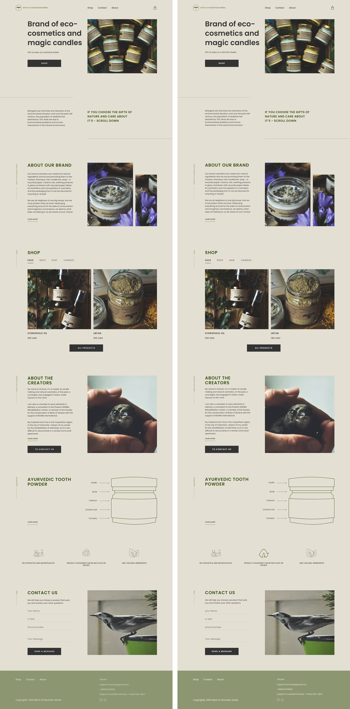

# Eco-Cosmetics Landing Page — Figma to HTML/CSS

A **pixel-accurate, fully responsive** implementation of a Figma design, built with clean HTML5 + CSS3 (no frameworks).

## Live demo
https://jackz0526.github.io/eco-cosmetics-landing/

## Highlights
- **Pixel-accurate**: average pixel difference < 2 / 255 against the Figma reference, at all three breakpoints.
- **Responsive**: desktop 1440px · tablet 768px · mobile 320px — each aligned to its own design frame.
- **Clean, maintainable code**: semantic HTML5 + CSS3, self-hosted Poppins webfont, real image/SVG assets.
- **Integration-friendly**: scoped, namespaced styling — safe to drop into an existing site.

## Preview (Figma design ⟷ coded result)


## Structure
```
index.html          # page markup
styles.css          # all styles (responsive breakpoints)
assets/             # images + SVG icons
fonts/              # Poppins (woff2, self-hosted)
showcase/           # design-vs-code comparison image
```

## Breakpoints
| Device  | Width |
|---------|-------|
| Desktop | 1440px |
| Tablet  | 768px |
| Mobile  | 320px |

## Design credit
The visual design is **not ours** — it is the "Brand of eco-cosmetics" Figma mockup referenced by
**RomanO3GIT / Eco-cosmetics-landing** (github.com/RomanO3GIT/Eco-cosmetics-landing).
This repository contains only our own front-end **code implementation** of that design, presented
as a **design-to-code** demonstration. All design rights remain with their original author.
